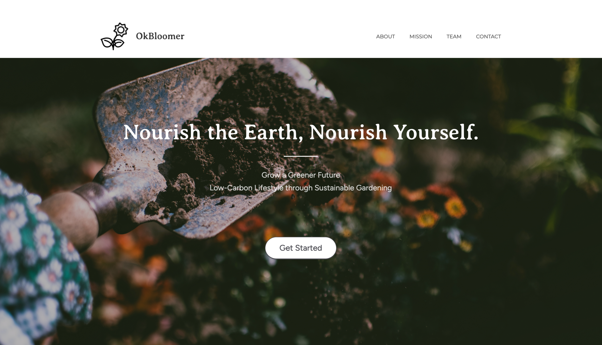

# botaneXt 2023 Spring Hackathon - CS

# Product name - OkBloomer

# Product description 
Our product is a sustainable gardening solution that helps individuals reduce their carbon footprint and become more self-sufficient in food production. Using our platform, users can input their location and customize their filtering options to find the best plants and vegetation suited for their climate. With a virtual try-on feature, users can visualize what their garden will look like before they commit to planting. Our mission is to empower individuals to join the low-carbon movement and make a positive impact on the environment. By tracking the user's carbon reduction goals, our product helps them to make quantifiable and meaningful contributions to the fight against climate change.

# Quick look of website

# Presentation link 
https://www.canva.com/design/DAFZjDkxZpk/BHLKvkfA5XsxwpFs4sndug/edit?utm_content=DAFZjDkxZpk&utm_campaign=designshare&utm_medium=link2&utm_source=sharebutton
